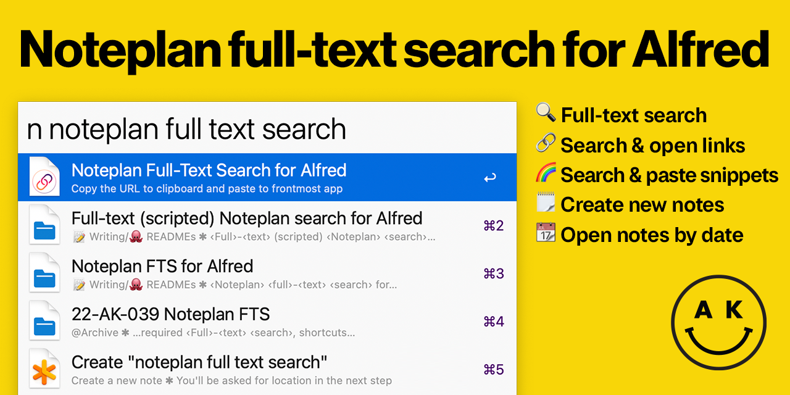

# Noteplan para Alfred



## ¿Qué es esto?

Noteplan para Alfred trae todas tus notas de Noteplan a Alfred 5 y versiones posteriores. Úsalo para:

- 🔍 Busca en todas tus notas con **búsqueda de texto completo**
- ⚡ **Usa Noteplan como gestor de enlaces** - Busca en todos tus hipervínculos y ábrelos inmediatamente en tu navegador predeterminado
- 🌈 **Usa Noteplan como gestor de fragmentos** - Busca en tus bloques de código (con título y descripción) y pégalos automáticamente en la aplicación en primer plano
- ✨ Crea notas nuevas fácilmente
- 📆 Ve a una fecha exacta, una fecha aproximada o incluso a una nota semanal/mensual/trimestral

Nota: este flujo de trabajo **requiere Alfred 5**. Utiliza opciones de configuración introducidas en la versión 5.

## Uso
- `n [Frase de búsqueda]` - Búsqueda de texto completo en todas las notas, bloques de código y hipervínculos
    - También incluye una opción para "crear una nota nueva"
    - si no hay coincidencia, la creación de nota será la única opción
- `nh [Frase]` - Busca en todos los hipervínculos que has anotado y ábrelos inmediatamente
- `nc [Frase]` - Busca todos tus bloques de código con título y pégalos en la aplicación en primer plano
- `nd [expresión de fecha]` - Analizador de fechas exactas/relativas muy sencillo
- `nn [Título de la nota]` - Crea una nota nueva en la carpeta que elijas
- `n !r` - Actualizar base de datos de notas
- `n !rf` - Forzar la actualización de cada nota en la base de datos
- `n !!` - Mostrar información de depuración

Todos los comandos son configurables. Para evitar que el flujo de trabajo sea demasiado complicado, si no deseas usar una función, simplemente establece el activador en algo complejo como `XYZ-extremely-unlikely-to-use`

### Hipervínculos

Cada hipervínculo - `[El título y una descripción](https://example.com)` - es buscable, tanto por el título y la descripción como por el enlace en sí. **La acción predeterminada para un hipervínculo es abrirlo en el navegador predeterminado**; para abrir la nota que lo contiene, presiona <kbd>CMD</kbd>+<kbd>↩</kbd>.

### Bloques de código

Cada bloque de código **con un título/descripción** se coincide como un fragmento. **La acción predeterminada es "copiar y pegar en la aplicación en primer plano"**; para abrir la nota que lo contiene, presiona <kbd>CMD</kbd>+<kbd>↩</kbd>.

#### Ejemplo de bloque de código:

````
```language (Title and a description in parentheses)
   This code bit will be matched as codebit by content, language and the title and description.
```
````

### Analizador de fechas
- `t … today` - nota de hoy
- `y … yesterday` - nota de ayer
- `tom … tomorrow` - nota de mañana
- `[20]?220401` - fecha exacta en formato Amd, donde el 20 inicial es opcional
- `0401` - día exacto, año actual (mes primero)
- `4/1` - día exacto, año actual (mes primero, cero inicial opcional)
- `1.4` - día exacto, año actual (día primero, cero inicial opcional)
- `1 4` - día exacto, año actual (cero inicial opcional, orden d/m configurable)
- `[-+]? [number] [dw]` - fecha relativa, número de días o semanas hacia atrás o adelante. Los espacios son opcionales
- `[wmq]` - nota de esta semana (mes, trimestre)
- `[wmq] [number]` -  nota semanal (mensual, trimestral) de la semana/mes/trimestre X
- `[wmq] -|+ [number]` - nota relativa de la semana (mes, trimestre) (espacios opcionales)
- `yr|year` - nota de este año
- `yr|year [XY]` - nota del año 20XY
- `yr|year -|+ [number]` - año relativo (espacios opcionales)

## Instalación
1. Descarga el flujo de trabajo (`alfred-noteplan-X.Y.Z.alfredworkflow`) desde la [página de 'Lanzamientos'](https://github.com/adamkiss/alfred-noteplan/releases) e impórtalo en Alfred
2. Configura el flujo de trabajo según tus necesidades y preferencias
    - la parte más importante y obligatoria es la **carpeta raíz de Noteplan**
    - obténla desde `Opciones de Noteplan` > `Sincronización` > `'Avanzado' para tu opción de sincronización activa` > `Abrir base de datos local`
    - esto abrirá una ventana del Finder
    - en esta ventana, con **nada seleccionado**, presiona <kbd>Command</kbd>+<kbd>Option</kbd>+<kbd>C</kbd> para copiar la ruta
    - pégala en la ventana de importación del flujo de trabajo
3. Confía en la aplicación. Este paso es necesario porque [la aplicación no está firmada](#why-all-the-warnings).      
   1. Escribe `n ` en Alfred: macOS te advertirá que esta aplicación no está firmada y que puedes moverla a la papelera o cancelar.
   2. Abre **Ajustes del Sistema** > **Privacidad y Seguridad**, desplázate hacia abajo y haz clic en "Permitir de todos modos". (En macOS anteriores a 13/Ventura, _Ajustes del Sistema_ se llama _Preferencias del Sistema_.)
   3. Escribe `n ` en Alfred nuevamente: macOS te advertirá _otra vez_ que esta aplicación se descargó de Internet y podría no ser segura.
   4. El cuadro de diálogo ahora tendrá una opción de **Abrir**. Haz clic en **Abrir** para finalizar la autorización.
4. ¡Listo!
5. Ahora puedes realizar una búsqueda, consultar una fecha o añadir una nota nueva

### ¿Por qué todas las advertencias?
Para que macOS acepte tu aplicación como segura, el desarrollador debe firmarla criptográficamente. Eso requiere la Programa de Desarrolladores de Apple, que cuesta 99 dólares al año, y que no necesito para nada más, por lo que, en mi opinión, las dos advertencias son aceptables para un flujo de trabajo gratuito.

### ¿No había un comando de actualización?
Lo había. Pero con la nueva versión, el flujo de trabajo solo actualiza las notas modificadas, y ese número suele ser muy pequeño, por lo que la base de datos se actualiza cada vez que se ejecuta este flujo de trabajo (con un retardo de ~10 segundos, para que mientras consultas tus notas, no intente actualizarse en cada llamada).

## Licencia

Derechos de autor (c) 2023 Adam Kiss

Se concede permiso, libre de cargos, a cualquier persona que obtenga una copia
de este software y de los archivos de documentación asociados (el "Software"), para utilizar
el Software sin restricción, incluyendo sin limitación los derechos
a usar, copiar, modificar, fusionar, publicar, distribuir, sublicenciar, y/o vender
copias del Software, y a permitir a las personas a las que se les proporcione el Software
hacerlo, siempre que cumplan las siguientes condiciones:

El aviso de derechos de autor anterior y este aviso de permiso se incluirán en todas
las copias o partes sustanciales del Software.

EL SOFTWARE SE PROPORCIONA "TAL CUAL", SIN GARANTÍA DE NINGÚN TIPO, EXPRESA O
IMPLÍCITA, INCLUIDAS PERO NO LIMITADAS A LAS GARANTÍAS DE COMERCIABILIDAD,
APTITUD PARA UN PROPÓSITO PARTICULAR E INFRACCIÓN DE DERECHOS. EN NINGÚN CASO LOS
AUTORES O TITULARES DE LOS DERECHOS DE AUTOR SERÁN RESPONSABLES DE NINGUNA REIVINDICACIÓN, DAÑOS U OTRAS
RESPONSABILIDADES, YA SEA EN UNA ACCIÓN DE CONTRATO, AGRAVIO O CUALQUIER OTRA
CIRCUNSTANCIA, DERIVADAS DE, FUERA DE O EN CONEXIÓN CON EL SOFTWARE O SU USO U OTRO
TIPO DE ACCIONES EN EL SOFTWARE.
