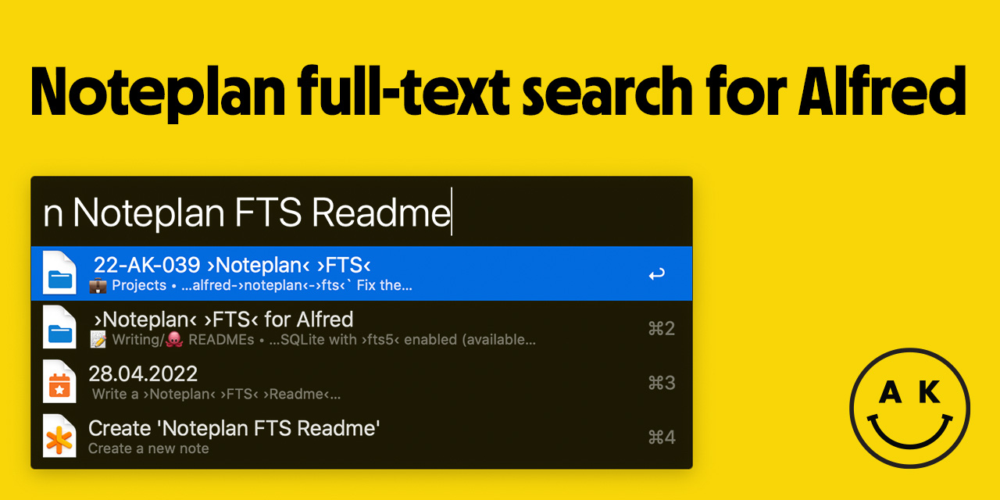

# Noteplan Full-text Search for Alfred 2

⚠️ This version is a release candidate for version 2, written in Dart. For "released" v1 writte in PHP, see [branch v1-archive](https://github.com/adamkiss/alfred-noteplan-fts/tree/v1-archive). The release candidate already has full feature parity with the first version, plus improved speed, support for new calendar notes, and no need for periodical run of index refresh. v1 is at this point available only for reference.

Search, open, and create Noteplan notes with Alfred.

---

## Usage
- `n [Search phrase]` - Full text search. If there isn't any note available, "Create new note" command is the only result
- `n >[date phrase]`, `n :[date phrase]` - Very simple exact date parser
- `nn [Title of the note]` - Creates a new note, in the folder of your choice
- `n !r` - Refresh note database
- `n !rf` - Force refresh every note in the database
- `n !!` - Show debug information

### Date parser
- `t … today` - today's note
- `y … yesterday` - yesterday's note
- `tom … tomorrow` - tomorrow's note
- `[-+]? [number] [dwm]` - relative date, number of days/weeks/months back and forward. spaces are optional
- `[wmq]` - this week's (month's, quarter's) note
- `[wmq] [-+]? [number]` - relative week's (month's, quarter's) note (spaces optional)
- `yr|year` - this year's note
- `yr|year [-+]? [number]` - relative year (spaces optional)

## Installation
1. Download and import the workflow
2. Configure it to your taste
    - the most important and required part is the **Noteplan root folder**
    - get it through `Noteplan Options` > `Sync` > `'Advanced' for your active Sync option` > `Open local database`
    - this will open a Finder window
    - in this window, with **nothing selected**, press <kbd>Command</kbd>+<kbd>Option</kbd>+<kbd>C</kbd> to copy the pathname 
    - paste that into the workflow import window
3. Run `n ` - macos will warn you that this app is unsigned and you can move it to bin or cancel
4. Open **System Settings** > **Privacy & Security**, scroll down, and click "Allow Anyway"
5. Run `n ` - macos will warn you that this app was downloaded from the internet nad might not be safe. Click 'open'
6. Profit!
7. You can now do a search, date query or add a new note

### Why all the warnings?
To have macos accept your app as safe, the developer needs to cryptographically sign it. That requires a $99/year Apple Developer Program, which I currently don't need for anything else.

### Wasn't there a refresh command?
There was. But with the new version, the workflow refreshes only changed notes since last update, and that's often a tiny number, so the databse is updated every time this workflow is run (with a timeout ~10 seconds, so when you're constructing your query, it runs only on the first letter).

## License

Copyright (c) 2023 Adam Kiss

Permission is hereby granted, free of charge, to any person obtaining a copy
of this software and associated documentation files (the "Software"), to deal
in the Software without restriction, including without limitation the rights
to use, copy, modify, merge, publish, distribute, sublicense, and/or sell
copies of the Software, and to permit persons to whom the Software is
furnished to do so, subject to the following conditions:

The above copyright notice and this permission notice shall be included in all
copies or substantial portions of the Software.

THE SOFTWARE IS PROVIDED "AS IS", WITHOUT WARRANTY OF ANY KIND, EXPRESS OR
IMPLIED, INCLUDING BUT NOT LIMITED TO THE WARRANTIES OF MERCHANTABILITY,
FITNESS FOR A PARTICULAR PURPOSE AND NONINFRINGEMENT. IN NO EVENT SHALL THE
AUTHORS OR COPYRIGHT HOLDERS BE LIABLE FOR ANY CLAIM, DAMAGES OR OTHER
LIABILITY, WHETHER IN AN ACTION OF CONTRACT, TORT OR OTHERWISE, ARISING FROM,
OUT OF OR IN CONNECTION WITH THE SOFTWARE OR THE USE OR OTHER DEALINGS IN THE
SOFTWARE.

## Licenses for libraries used

See [LICENSES](./workflow/LICENSES)
