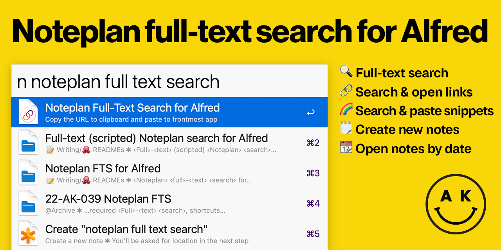

# Alfred Noteplan v2



## What is this

Noteplan for Alfred brings all your Noteplan notes to Alfred! Use it to:

- 🔍 Search through all of your notes, with **full-text search**
- ⚡ **Use Noteplan as link manager** - Search through all of your hyperlinks, and immediately open them in your default browser
- 🌈 **Use Noteplan as snippet manager** - Search through your code bits (with title and description), and automatically paste them to your frontmost app
- ✨ Create new notes easily
- 📆 Go to an exact date, fuzzy date or even a weekly/monthly/quarterly note

## Usage
- `n [Search phrase]` - Full text search. If there isn't any note available, "Create new note" command is the only result
- `nh [Phrase]` - Search through all the hyperlinks you noted down - and open them immediately
- `nc [Phrase]` - Search for all your titled code bits - and paste them to the frontmost app
- `nd [date phrase]` - Very simple exact/relative date parser
- `nn [Title of the note]` - Creates a new note, in the folder of your choice
- `n !r` - Refresh note database
- `n !rf` - Force refresh every note in the database
- `n !!` - Show debug information

All commands are configurable. To keep the workflow from being too complicated, if you don't wish to use a feature, just set the trigger to something complicated like `XYZ-extremely-unlikely-to-use`

### Hyperlinks

Every hyperlink - `[The title and a description](https://example.com)` - is searchable, through the title and description and the link itself as well. **The default action for a hyperlink is to open it in a default browser**, to open the containing note, hit <kbd>CMD</kbd>+<kbd>↩</kbd>.

### Code bits

Every block of code **with a title/description** is matched as a snippet. **Default action is "copy and paste in the frontmost app"**, to open the containing note, hit <kbd>CMD</kbd>+<kbd>↩</kbd>.

#### Example code bit:

```
    ```language (Title and a description in parentheses)
        This code bit will be matched as codebit by content, language and the title and description.
    ```
```

### Date parser
- `t … today` - today's note
- `y … yesterday` - yesterday's note
- `tom … tomorrow` - tomorrow's note
- `[20]?220401` - exact date in Ymd format, where the initial 20 is optional
- `0401` - exact day, current year (month first)
- `4/1` - exact day, current year (month first, leading zero optional)
- `1.4` - exact day, current year (day first, leading zero optional)
- `1 4` - exact day, current year (leading zero optional, d/m order configurable)
- `[-+]? [number] [dw]` - relative date, number of days or weeks back and forward. spaces are optional
- `[wmq]` - this week's (month's, quarter's) note
- `[wmq] [number]` -  weekly (monthly, quarterly) note of w/m/q X
- `[wmq] -|+ [number]` - relative week's (month's, quarter's) note (spaces optional)
- `yr|year` - this year's note
- `yr|year [XY]` - note of the year 20XY
- `yr|year -|+ [number]` - relative year (spaces optional)

## Installation
1. Download the workflow (`alfred-noteplan-X.Y.Z.alfredworkflow`) from the ['Releases' page](https://github.com/adamkiss/alfred-noteplan/releases) and import the workflow to Alfred
2. Configure the workflow as you need and want
    - the most important and required part is the **Noteplan root folder**
    - get it through `Noteplan Options` > `Sync` > `'Advanced' for your active Sync option` > `Open local database`
    - this will open a Finder window
    - in this window, with **nothing selected**, press <kbd>Command</kbd>+<kbd>Option</kbd>+<kbd>C</kbd> to copy the pathname 
    - paste that into the workflow import window
3. Trust the app. This step is necessary because [the app is not signed](#why-all-the-warnings).      
   1. Type `n ` in Alfred - macOS will warn you that this app is unsigned and you can move it to bin or cancel.
   2. Open **System Settings** > **Privacy & Security**, scroll down, and click "Allow Anyway". (In macOS before 13/Ventura, _System Settings_ is called _System Preferences_.)
   3. Type `n ` in Alfred again - macOS will warn you _again_ that this app was downloaded from the internet and might not be safe.
   4. The dialog now has an **Open** option. Click **Open** to finalize the authorization.
4. Profit!
5. You can now do a search, date query or add a new note

### Why all the warnings?
To have macOS accept your app as safe, the developer needs to cryptographically sign it. That requires a $99/year Apple Developer Program, which I don't need for anything else, so the two warnings are acceptable for a free workflow, in my opinion.

### Wasn't there a refresh command?
There was. But with the new version, the workflow refreshes only changed notes since last update, and that's often a tiny number, so the databse is updated every time this workflow is run (with a timeout ~10 seconds, so when you're constructing your query, it runs only on the first letter).

## License

Copyright (c) 2023 Adam Kiss

Permission is hereby granted, free of charge, to any person obtaining a copy
of this software and associated documentation files (the "Software"), to deal
in the Software without restriction, including without limitation the rights
to use, copy, modify, merge, publish, distribute, sublicense, and/or sell
copies of the Software, and to permit persons to whom the Software is
furnished to do so, subject to the following conditions:

The above copyright notice and this permission notice shall be included in all
copies or substantial portions of the Software.

THE SOFTWARE IS PROVIDED "AS IS", WITHOUT WARRANTY OF ANY KIND, EXPRESS OR
IMPLIED, INCLUDING BUT NOT LIMITED TO THE WARRANTIES OF MERCHANTABILITY,
FITNESS FOR A PARTICULAR PURPOSE AND NONINFRINGEMENT. IN NO EVENT SHALL THE
AUTHORS OR COPYRIGHT HOLDERS BE LIABLE FOR ANY CLAIM, DAMAGES OR OTHER
LIABILITY, WHETHER IN AN ACTION OF CONTRACT, TORT OR OTHERWISE, ARISING FROM,
OUT OF OR IN CONNECTION WITH THE SOFTWARE OR THE USE OR OTHER DEALINGS IN THE
SOFTWARE.