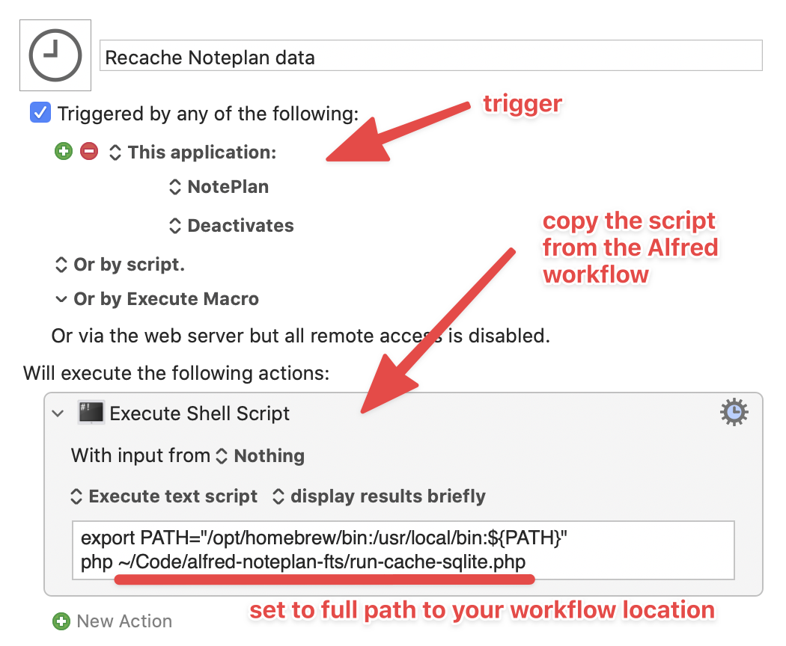

# Noteplan FTS for Alfred


Noteplan full-text search for Alfred - some assembly required. Work in progress, mostly working.

---

## Usage
- `n [Search phrase]` - Full text search. If there isn't any note available, "Create new note" command is the only result
- `nn Title of the note` - Creates a new note, in the folder of your choice
- `nref` - Refresh SQLite database

## Requirements
- PHP install available in CLI
- SQLite with fts5 enabled (available by default in the SQLite "amalgamation" build bundled with Homebrew PHP)

## Installation
0. Ensure you have all the requirements (Homebrew, PHP) installed
1. Clone this repository to your alfred workflows folder (or elsewhere and symlink it)
2. Create `_config.php`, which at minimum contains absolute path to your noteplan document root
	- You can find it in Settings: Settings → Sync → [Sync method] → Advanced → Open Local Database Folder
	- "root" is the folder that containes all your things - Backups, Notes, Calendar items, templates. Everything.
3. Run `nref` in the Alfred to generate your sqlite cache for the first time
4. Run `nref` everytime you close the Noteplan app, or setup any kind of automation for a periodical run of the alred caching action. There are multiple options for this, and it depends on what you're the most comfortable with.
	- `launchd`/`launchctl` script
	- You can also use [Lingon](https://www.peterborgapps.com/lingon/)
	- [Keyboard Maestro](https://www.keyboardmaestro.com/main/) script (example below)

## Minimal `_config.php` example:
``` php
<?php 
return [
  'noteplan_root' => '/absolute/path/to/noteplan/'
];
```

## Example periodic cache refresh with Keyboard Maestro
For 500 notes, current runtime of the note import script is `~500ms`, which is fast enough to have it setup to run every time Noteplan window loses its focus. This is how I have it currently setup:



Edit: I've now updated the script to run _a minute_ after Noteplan was deactivated, with a bit of logic to cancel previous waiting runs of the keyboard maestro script, which is useful if you're transferring data between noteplan and other apps. You can find the macro to import in the `additional/` folder, just don't forget to edit the absolute path to the `run-cache-sqlite.php` file in your workflow folder. 

## License
MIT License

## Version 2 notes:
- Add README re: homebrew/mamp PHP via .zshrc

---

© 2022 Adam Kiss